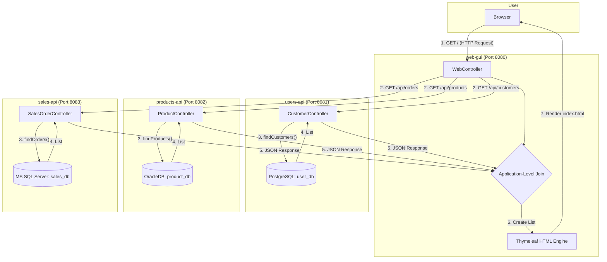

# Java Database Project: A Multi-Database E-Commerce System

**Student:** Ciotir Marian-Augustin
**Group:** 244

---

## 1. Introduction

This document provides a detailed description of the Java application built for the database homework. The project's core objective is to demonstrate the ability to design and implement a system that interacts with three different relational database management systems (RDBMS) simultaneously: **PostgreSQL**, **OracleDB**, and **Microsoft SQL Server**.

The requirements specify that each database must host a unique table, and these tables must be logically linked. The application must implement all four **CRUD** (Create, Read, Update, Delete) operations and provide a graphical user interface (GUI) for interaction.

The adopted solution is a **Microservice Architecture** built with the Spring Boot framework. This approach consists of four independent applications: three backend services (one for each database) that expose their data via a REST API, and one frontend "GUI" application that consumes these APIs and orchestrates the business logic.

---

## 2. Theoretical Aspects

This project is a practical application of several fundamental computer science and software engineering theories.

### 2.1. Object-Relational Mapping (ORM)

**ORM** is a programming technique for converting data between incompatible type systems in object-oriented programming languages and relational databases. In short, it allows us to write Java code (using Objects) and have it automatically translate into database-readable SQL (using Tables and Rows).

- **JPA (Java Persistence API):** This is the **specification** (the "rulebook") for ORM in Java. It provides a set of annotations and interfaces.
- **Hibernate:** This is the **implementation** (the "engine") that we use, which is managed by Spring Data JPA.
- **Core Objects:**
  - `@Entity`: An annotation that marks a Java class (like `Customer`) as a "mirror" for a database table.
  - `EntityManager`: The primary JPA interface used to perform database operations (like persisting, merging, removing entities).
  - `JpaRepository`: A Spring Data abstraction that _hides_ the `EntityManager` and automatically provides all common CRUD methods (`.save()`, `.findAll()`, etc.) for an entity.

### 2.2. Database Normalization and Data Integrity

This project's database schema is designed around **normalization**, specifically to avoid **data redundancy** and **update anomalies**.

- **Theory:** The `sales_orders` table stores _only_ the `customer_id_link` and `product_id_link`. It does **not** store the customer's name or the product's price.
- **Why?** If we stored the customer's name in the `sales_orders` table and a customer later updated their name, all their past orders would still show the _old_ name. This is an **update anomaly**.
- **Solution:** By storing only the ID (the "pointer"), we maintain a single source of truth. The `customers` table is the _only_ place a customer's name is stored. When we need to display an order, we use this ID to "look up" the current name, ensuring data is always consistent.

### 2.3. Architectural Patterns: Microservice vs. Monolith

The way we structure the application is a core architectural decision.

- **Monolithic (Alternative) Solution:** A single Spring Boot application could be built. This would require complex manual configuration to define three separate `DataSource`, `EntityManagerFactory`, and `PlatformTransactionManager` beans. This approach is prone to configuration conflicts, bean instantiation order problems, and complex `exclude` flags on the main `@SpringBootApplication` annotation (as was discovered during initial prototyping).

- **Microservice (Adopted) Solution:** The chosen architecture consists of four applications. This design is based on the theory of **Separation of Concerns**.
  1.  **Isolation:** Each backend service (`users-api`, `products-api`, `sales-api`) is a standard, simple Spring Boot application. Its _only_ concern is its _one_ database. This eliminates all complex multi-database configuration issues.
  2.  **Scalability:** Each service can be scaled, updated, and restarted independently.
  3.  **Clarity of Logic:** The "business logic" and "linking" is explicitly handled by the `web-gui` application.

### 2.4. REST APIs and Service Orchestration

Since the databases are in separate services, they cannot be "joined" at the database level. The link must be created at the application level.

- **REST (Representational State Transfer):** This is the architectural style used for communication. Each backend service exposes its data as **resources** (e.g., `/api/customers`). We use standard HTTP methods (`GET`, `POST`, `PUT`, `DELETE`) to interact with these resources.
- **Service Orchestration (Application-Level Join):** This is the most important "link" concept. The `web-gui` application acts as an **Orchestrator**. As seen in the `getHomePage()` method, it:
  1.  Fetches data from all three independent API "endpoints."
  2.  Performs the "join" in the application's memory by iterating through the orders and using `Map` objects to look up the corresponding customer and product names.
  3.  Presents the final, merged data to the user in the GUI.

---

## 3. System Architecture

### 3.1. Architectural Diagram (Processing Sequence)

The following diagram illustrates the system's architecture and the data flow for the main "Read" operation (loading the home page). This flow demonstrates the **application-level join** performed by the `web-gui` as described in the theoretical aspects.



### 3.2. Technology Stack

- **Core:** Java 17, Spring Boot 3.x
- **Data Access:** Spring Data JPA (Hibernate)
- **Web & GUI:** Spring Web, Thymeleaf
- **API Client:** Spring `RestTemplate`
- **Databases:**
  - PostgreSQL 16
  - OracleDB 21c Express Edition
  - Microsoft SQL Server 2022 Express Edition
- **Utilities:** Lombok, Spring Boot DevTools
- **Build:** Maven

---

## 4. Database Schema and Configuration

### 4.1. Database Schema

The three databases are designed to be independent, with the "link" existing only as a simple ID value in the `sales_orders` table, following the normalization principles discussed.

- **`user_db` (PostgreSQL)**

  - `customers` (table): Stores user information.
    - `id` (BIGSERIAL, Primary Key)
    - `full_name` (VARCHAR)
    - `email` (VARCHAR, Unique)

- **`product_admin` schema (OracleDB @ XEPDB1)**

  - `products` (table): Stores product catalog information.
    - `id` (NUMBER, Primary Key)
    - `product_name` (VARCHAR2)
    - `price` (NUMBER)
  - `PRODUCT_ID_SEQ` (sequence): A database sequence used to generate the `id` for `products`, as is standard for Oracle.

- **`sales_db` (MS SQL Server)**
  - `sales_orders` (table): Stores order transactions and provides the logical link.
    - `id` (BIGINT, Primary Key, IDENTITY)
    - `order_date` (DATETIME2)
    - `customer_id_link` (BIGINT): A number that corresponds to an `id` in the `customers` table.
    - `product_id_link` (BIGINT): A number that corresponds to an `id` in the `products` table.

### 4.2. Operational Context (Database Setup)

For the applications to be operational, the databases must be configured as follows:

1.  **PostgreSQL:**
    - A user `user_admin` (password: `password`) must be created.
    - A database `user_db` must be created and owned by `user_admin`.
2.  **OracleDB:**
    - A user `product_admin` (password: `password`) must be created inside the `XEPDB1` pluggable database.
    - This user must be granted `CONNECT` and `RESOURCE` privileges and a quota (`QUOTA UNLIMITED ON USERS`).
3.  **MS SQL Server:**
    - A database `sales_db` must be created.
    - A login `sales_admin` (password: `password`) must be created.
    - This login must be mapped to a user `sales_admin` inside `sales_db` and granted the `db_owner` role.
    - **Crucially,** the SQL Server instance must be configured via **SQL Server Configuration Manager** to:
      1.  Enable the **TCP/IP** protocol.
      2.  Be restarted.
    - **Crucially,** the server properties must be set via **SSMS** to:
      1.  Allow **"SQL Server and Windows Authentication mode"**.
      2.  Be restarted again.

---

## 5. Component Description (Implementation)

This section details the primary objects and method prototypes for each of the four applications, as requested.

### 5.1. Backend API: `users-api`

- **`Customer` (Entity)**
  - A JPA Entity bean representing a row in the `customers` table.
  - **Fields:** `id` (Long, PK, `@GeneratedValue(strategy = IDENTITY)`), `fullName` (String), `email` (String, `@Column(unique = true)`).
- **`CustomerRepository` (Interface)**
  - `public interface CustomerRepository extends JpaRepository<Customer, Long>`
  - A Spring Data JPA repository that automatically provides all necessary CRUD methods (`save`, `findById`, `findAll`, `deleteById`).
- **`CustomerController` (REST API)**
  - **Context:** A `@RestController` that handles HTTP requests for customers at the `/api/customers` base path.
  - **Constructor:** `public CustomerController(CustomerRepository repository)` (Uses `@Autowired` for dependency injection).
  - **Method Prototypes:**
    - `public List<Customer> getAllCustomers()`: (GET /) Returns a JSON list of all customers.
    - `public Customer createCustomer(@RequestBody Customer customer)`: (POST /) Creates a new customer from the JSON request body. Returns the saved `Customer` object with its new ID.
    - `public Customer getCustomerById(@PathVariable Long id)`: (GET /{id}) Returns a single `Customer` by their ID. Returns `null` if not found.
    - `public Customer updateCustomer(@PathVariable Long id, @RequestBody Customer updatedCustomer)`: (PUT /{id}) Finds a customer by ID and updates their `fullName` and `email`. Returns the updated `Customer`.
    - `public void deleteCustomer(@PathVariable Long id)`: (DELETE /{id}) Deletes a customer by their ID.

### 5.2. Backend API: `products-api`

- **`Product` (Entity)**
  - A JPA Entity bean for the `products` table.
  - **Fields:** `id` (Long, PK, uses `@SequenceGenerator(name = "product_seq", ...)`), `productName` (String), `price` (double).
- **`ProductRepository` (Interface)**
  - `public interface ProductRepository extends JpaRepository<Product, Long>`
- **`ProductController` (REST API)**
  - **Context:** A `@RestController` that handles requests at `/api/products`.
  - **Method Prototypes:**
    - `public List<Product> getAllProducts()`: (GET /) Returns a JSON list of all products.
    - `public Product createProduct(@RequestBody Product product)`: (POST /) Creates a new product.
    - `public Product getProductById(@PathVariable Long id)`: (GET /{id}) Returns a single product.
    - `public Product updateProduct(@PathVariable Long id, @RequestBody Product updatedProduct)`: (PUT /{id}) Updates a product's name and price.
    - `public void deleteProduct(@PathVariable Long id)`: (DELETE /{id}) Deletes a product.

### 5.3. Backend API: `sales-api`

- **`SalesOrder` (Entity)**
  - A JPA Entity bean for the `sales_orders` table.
  - **Fields:** `id` (Long, PK, `@GeneratedValue(strategy = IDENTITY)`), `orderDate` (LocalDateTime), `customerIdLink` (Long), `productIdLink` (Long).
  - **Method Prototypes:**
    - `protected void onCreate()`: A `@PrePersist` method that automatically sets the `orderDate` to `LocalDateTime.now()` before a new order is saved.
- **`SalesOrderRepository` (Interface)**
  - `public interface SalesOrderRepository extends JpaRepository<SalesOrder, Long>`
- **`SalesOrderController` (REST API)**
  - **Context:** A `@RestController` that handles requests at `/api/orders`.
  - **Method Prototypes:**
    - `public List<SalesOrder> getAllOrders()`: (GET /) Returns a JSON list of all orders.
    - `public SalesOrder createOrder(@RequestBody SalesOrder order)`: (POST /) Creates a new order. The request body only needs to contain `customerIdLink` and `productIdLink`.
    - `public SalesOrder getOrderById(@PathVariable Long id)`: (GET /{id}) Returns a single order.
    - `public SalesOrder updateOrder(@PathVariable Long id, @RequestBody SalesOrder updatedOrder)`: (PUT /{id}) Updates an order's `customerIdLink` and `productIdLink`.
    - `public void deleteOrder(@PathVariable Long id)`: (DELETE /{id}) Deletes an order.

### 5.4. Frontend GUI: `web-gui`

- **`AppConfig` (Configuration)**
  - A `@Configuration` class.
  - **Method Prototypes:**
    - `public RestTemplate restTemplate()`: A `@Bean` method that creates and provides a singleton `RestTemplate` instance for making HTTP calls to the other APIs.
- **DTOs (Data Transfer Objects)**
  - **Context:** Plain Java objects in the `dto` package used to "mirror" the JSON data received from the APIs. All use `@Data` (Lombok) and `@JsonIgnoreProperties(ignoreUnknown = true)`.
  - **Objects:** `Customer`, `Product`, `SalesOrder`.
  - **`OrderDetails` Object:** A composite DTO created by the `WebController` to hold the "merged" data.
  - **Fields:** `id`, `orderDate`, `customerId`, `customerName`, `productId`, `productName`.
- **`WebController` (Controller & Orchestrator)**
  - **Context:** A Spring `@Controller` that serves Thymeleaf HTML pages and orchestrates API calls.
  - **Constructor:**
    - `public WebController(RestTemplate restTemplate, @Value(...) String usersApiUrl, ...)`: Injects the `RestTemplate` bean and the three API base URLs from `application.properties`.
  - **Method Prototypes:**
    - `public ModelAndView getHomePage()`: (GET /)
      - **Processing Sequence:**
        1.  Calls the `users-api` to get `List<Customer>`.
        2.  Calls the `products-api` to get `List<Product>`.
        3.  Calls the `sales-api` to get `List<SalesOrder>`.
        4.  Converts the Customer and Product lists into `Map<Long, T>` for fast lookup.
        5.  Loops through the `SalesOrder` list and builds a new `List<OrderDetails>`, populating `customerName` and `productName` from the maps (the "application-level join").
        6.  Returns a `ModelAndView` for the `index.html` template, populated with all the data.
      - **Exceptions:** Catches `RestClientException` if any API is unreachable and returns empty lists.
    - `public String createCustomer(@RequestParam String fullName, @RequestParam String email)`: (POST /create-customer)
      - **Processing Sequence:** Creates a new `Customer` DTO and uses `restTemplate.postForObject(...)` to send it to the `users-api`.
      - **Returns:** `String "redirect:/"` to reload the home page.
    - `public String createProduct(@RequestParam String productName, @RequestParam double price)`: (POST /create-product) Calls the `products-api`.
    - `public String createOrder(@RequestParam Long customerIdLink, @RequestParam Long productIdLink)`: (POST /create-order)
      - **Processing Sequence:** Performs a validation check by calling `restTemplate.getForObject(...)` on the `users-api` to ensure the `customerIdLink` is valid. (A similar check for `productIdLink` is also implemented). If valid, it sends the new `SalesOrder` DTO to the `sales-api`.
      - **Returns:** `String "redirect:/"` or a redirect with an error message.
    - `public ModelAndView showEditCustomerPage(@PathVariable Long id)`: (GET /edit-customer/{id})
      - **Processing Sequence:** Calls `restTemplate.getForObject(...)` on the `users-api` to fetch the data for a single customer.
      - **Returns:** A `ModelAndView` for the `edit-customer.html` template, with the `customer` object in the model to pre-fill the form.
    - `public String updateCustomer(@ModelAttribute Customer customer)`: (POST /update-customer)
      - **Processing Sequence:** Receives the `Customer` object from the form (bound by `@ModelAttribute`). Uses `restTemplate.exchange(..., HttpMethod.PUT, ...)` to send the updated object to the `users-api`.
      - **Returns:** `String "redirect:/"`.
    - `public String deleteCustomer(@PathVariable Long id)`: (GET /delete-customer/{id})
      - **Processing Sequence:** Uses `restTemplate.delete(...)` to call the `users-api`.
      - **Returns:** `String "redirect:/"`.
    - _(Similar Update/Delete prototypes exist for `Product` and `SalesOrder`)_.

---

## 6. Examples of Use (Test Battery)

The following tests can be performed from the GUI at `http://localhost:8080` to validate all system functionality.

**Prerequisite:** All four applications (`users-api`, `products-api`, `sales-api`, `web-gui`) are running.

1.  **Test Create (C):**

    - **Action:** In the "New Customer" form, create a customer "John Doe" (john@doe.com).
    - **Output:** The page reloads, and "John Doe" appears in the "Customers" table.
    - **Action:** In the "New Product" form, create a product "Laptop" (Price: 1500).
    - **Output:** The page reloads, and "Laptop" appears in the "Products" table.

2.  **Test Read (R) and "The Link":**

    - **Action:** Observe the IDs for "John Doe" and "Laptop".
    - **Action:** In the "New Order" form, enter these two IDs.
    - **Output:** The page reloads. The "Orders" table shows a new order.
    - **Verification:** The order row correctly displays the _names_ "John Doe" and "Laptop" instead of just the IDs. This proves the application-level join is working.

3.  **Test Update (U):**

    - **Action:** Click the "Edit" link next to "John Doe". You are taken to the "Edit Customer" page.
    - **Action:** Change the name to "John Smith" and click "Update".
    - **Output:** The page redirects back to the index.
    - **Verification:** The "Customers" table now shows "John Smith". Critically, the "Orders" table (which previously showed "John Doe") now _also_ shows "John Smith" for the existing order, proving the join is dynamic and data is not duplicated.

4.  **Test Delete (D):**

    - **Action:** Click the "Delete" link next to the order you created.
    - **Output:** The page reloads, and the order is removed from the "Orders" table.
    - **Action:** Click the "Delete" next to "John Smith".
    - **Output:** The page reloads, and the customer is removed from the "Customers" table.

5.  **Test "Broken Link" (Exception Handling):**
    - **Action:** Create a new customer "Jane" (ID 2) and a new order for her.
    - **Action:** Click "Delete" next to "Jane".
    - **Output:** The customer "Jane" is gone.
    - **Verification:** The "Orders" table still shows Jane's order, but the customer name column now displays "N/A (ID not found)". This correctly demonstrates what happens to the logical link when a parent record is removed.

```

```
