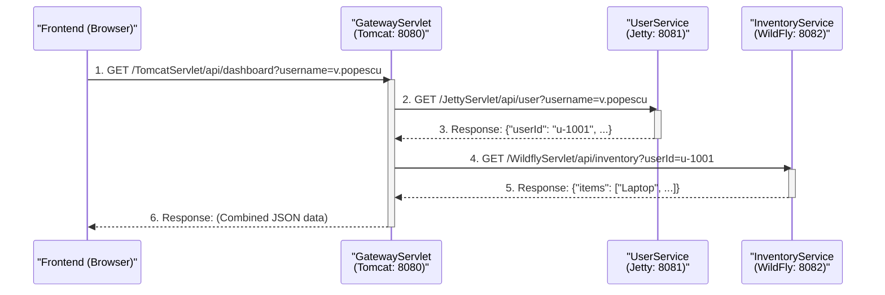

# Project: Distributed Servlet Application (Microservice Simulation)

**Student:** `[Your Name Here]`
**Group:** `[Your Group Number Here]`

---

## 1. Introduction

This project demonstrates the core principles of a distributed, **microservice-based architecture** using fundamental Java technologies. The primary goal is to fulfill the requirement of having multiple servlets, running on different application servers, communicating with each other to complete a single user request.

The application simulates a company's backend dashboard. A central **API Gateway** servlet receives a request from a user. To fulfill this request, it communicates with two separate, independent "microservices": a **User Service** and an **Inventory Service**. These services run on their own servers, and the gateway is responsible for aggregating their data and returning a single, combined response to the user.

This architecture is a common pattern for modern web applications, as it separates concerns, allows services to be scaled independently, and provides a single, stable entry point (the gateway) for a frontend client.

---

## 2. Theoretical Concepts

### Java Servlets

A **Java Servlet** is a Java class that runs on a web server and is designed to handle HTTP requests. It acts as the *middle layer* between a client (like a web browser) and the server's backend logic.

When a server (like **Tomcat**) receives a request, it hands it to the **Servlet Container**. The container identifies which servlet is responsible for the request's URL (e.g., `/api/user`) and calls that servlet's `doGet()` or `doPost()` method. Our entire backend logic is built using three servlets.

### Microservice Architecture

Instead of building one giant application (a "monolith"), a **microservice architecture** splits the application into a collection of small, independent services. Each service is responsible for one specific business function.

* **Our Project:** We simulate this by creating three separate projects:
    1.  **UserService**: Only manages user data.
    2.  **InventoryService**: Only manages inventory data.
    3.  **GatewayService**: Only manages routing and data aggregation.

### API Gateway Pattern

In a microservice architecture, a client (like a web or mobile app) should not have to know the addresses of all 10 (or 100) microservices. The **API Gateway** is a single server that acts as the only entry point. The client makes one call to the gateway, and the gateway then internally calls all the other services needed to get the data. Our `GatewayServlet` on **Tomcat** fulfills this exact role.

---

## 3. System Architecture

The system consists of five main components deployed across three servers.

### 3.1. Components

1.  **Application Servers (AS):**
    * **Apache Tomcat 11**: Runs the API Gateway.
    * **Eclipse Jetty 12**: Runs the User Service.
    * **WildFly 37**: Runs the Inventory Service.
2.  **Backend Applications (Microservices):**
    * **Gateway Service** (`TomcatServlet.war`): A Java web application responsible for receiving client requests and orchestrating communication with the other services.
    * **User Service** (`JettyServlet.war`): A Java web application that exposes an API to find user details. It reads from its own `users.json` "database."
    * **Inventory Service** (`WildflyServlet.war`): A Java web application that exposes an API to find a user's inventory. It reads from `inventory.json`.
3.  **Frontend Client** (`index.html`):
    * A single, standalone HTML file with JavaScript. It is **not** hosted on any server; it is opened directly from the local filesystem (`file:///...`). It uses the `fetch` API to communicate with the Gateway.
4.  **Data Files** (`users.json`, `inventory.json`):
    * These files act as simple, read-only databases for their respective services, bundled inside their `.war` files.

### 3.2. Request & Data Flow

The core of the project is the sequence of HTTP calls required to fulfill one request.

## 4. Component Specification

This section describes the main objects and methods used in the solution, as per the documentation requirements.

### 4.1. Project 1: Gateway Service (Tomcat)

* **Class: `GatewayServlet`**
    * `extends HttpServlet`
    * **Description**: Acts as the *API Gateway*. It validates the incoming request, calls the User service to get a User ID, and then calls the Inventory service with that ID.
    * **Methods:**
        * `protected void doGet(HttpServletRequest req, HttpServletResponse resp)`
            * **Params**: `req` (provides `username`), `resp` (used to send final JSON or error).
            * **Returns**: `void`.
            * **Throws**: `IOException`.
        * `private JsonObject makeRequest(String url)`
            * **Params**: `url` (The full URL of the microservice to call).
            * **Returns**: `JsonObject` (The parsed JSON response from the downstream service).
            * **Throws**: `IOException`, `InterruptedException`.

### 4.2. Project 2: User Service (Jetty)

* **Class: `UserService`** (You named this `JettyServlet`)
    * `extends HttpServlet`
    * **Description**: Manages user data. It loads a list of users from `users.json` on startup and provides an API to find a user by their username.
    * **Methods:**
        * `public void init(ServletConfig config)`
            * **Params**: `config` (Used to get the `ServletContext` to find the `users.json` file).
            * **Returns**: `void`.
            * **Throws**: `ServletException` (If the `users.json` file cannot be loaded, this method throws an exception to stop the servlet from starting).
        * `private void loadUserDatabase(ServletContext context)`
            * **Params**: `context` (The `ServletContext` object).
            * **Returns**: `void`.
            * **Throws**: `IOException`.
        * `protected void doGet(HttpServletRequest req, HttpServletResponse resp)`
            * **Params**: `req` (provides `username`), `resp` (sends back the user JSON or 404 error).
            * **Returns**: `void`.
            * **Throws**: `IOException`.

* **Class: `User`**
    * **Description**: A simple POJO (Plain Old Java Object) used by the **Gson** library to map data from `users.json`.
    * **Constructors**: Default constructor is used by Gson.
    * **Fields**:
        * `String userId`
        * `String username`
        * `String status`

### 4.3. Project 3: Inventory Service (WildFly)

* **Class: `InventoryService`** (You named this `WildflyServlet`)
    * `extends HttpServlet`
    * **Description**: Manages inventory data. It loads a map of inventories from `inventory.json` on startup and provides an API to find an inventory by `userId`.
    * **Methods:**
        * `public void init(ServletConfig config)`
            * **Params**: `config` (Used to get the `ServletContext` to find the `inventory.json` file).
            * **Returns**: `void`.
            * **Throws**: `ServletException` (If the `inventory.json` file cannot be loaded).
        * `private void loadInventoryDatabase(ServletContext context)`
            * **Params**: `context` (The `ServletContext` object).
            * **Returns**: `void`.
            * **Throws**: `IOException`.
        * `protected void doGet(HttpServletRequest req, HttpServletResponse resp)`
            * **Params**: `req` (provides `userId`), `resp` (sends back the inventory JSON or 404 error).
            * **Returns**: `void`.
            * **Throws**: `IOException`.

* **Class: `Inventory`**
    * **Description**: A POJO used by **Gson** to map data from `inventory.json`.
    * **Constructors**: Default constructor is used by Gson.
    * **Fields**:
        * `List<String> items`

---

## 5. Deployment & Operational Context

This application is designed to run in a *distributed environment*. The components are only operational when all three servers are running and configured correctly.

1.  **Prerequisites**:
    * JDK 24 (or the version used for compilation) must be installed.
    * The `JAVA_HOME` environment variable must be set correctly.
    * **Apache Maven** must be installed to build the projects.
    * All three server (**Tomcat**, **Jetty**, **WildFly**) binaries must be available.

2.  **Environment Setup**:
    * **Tomcat**: Runs on its default port **8080**.
    * **Jetty**: The `jetty-base` is configured and started with the property `jetty.http.port=8081`.
    * **WildFly**: The `standalone.xml` configuration file is modified to set the HTTP port to **8082**.

3.  **Build Process**:
    * Each of the three projects must be built independently by running `mvn clean package` from its root directory. This produces three `.war` files:
        1.  `TomcatServlet.war` (or `api-gateway.war`)
        2.  `JettyServlet.war` (or `user-service.war`)
        3.  `WildflyServlet.war` (or `inventory-service.war`)

4.  **Deployment (Manual, Not from IDE)**:
    * All three servers are started from the command line (`startup.bat`, `java -jar start.jar`, `standalone.bat`).
    * `TomcatServlet.war` is copied to `C:\Servers\tomcat\webapps\`.
    * `JettyServlet.war` is copied to `C:\Servers\jetty-base\webapps\`.
    * `WildflyServlet.war` is copied to `C:\Servers\wildfly\standalone\deployments\`.

---

## 6. Usage Examples & Test Cases

The application is tested using the standalone `index.html` frontend.

### Test Case 1: Successful Data Retrieval

* **Action**: User opens `index.html`, leaves the name "**v.popescu**" in the text box, and clicks "Get Data".
* **Request Chain**:
    1.  `GET http://localhost:8080/TomcatServlet/api/dashboard?username=v.popescu`
    2.  `GET http://localhost:8081/JettyServlet/api/user?username=v.popescu`
    3.  `GET http://localhost:8082/WildflyServlet/api/inventory?userId=u-1001`
* **Expected Output**: The frontend displays a "User Details" card and an "Inventory" card with the user's data and list of items.

### Test Case 2: Successful Alternate Data

* **Action**: User opens `index.html`, enters "**s.kovacs**" in the text box, and clicks "Get Data".
* **Request Chain**:
    1.  `GET http://localhost:8080/TomcatServlet/api/dashboard?username=s.kovacs`
    2.  `GET http://localhost:8081/JettyServlet/api/user?username=s.kovacs`
    3.  `GET http://localhost:8082/WildflyServlet/api/inventory?userId=u-1007`
* **Expected Output**: The frontend displays the cards for user "s.kovacs" and their inventory ("Scaun Ergonomic", etc.).

### Test Case 3: User Not Found (Error Handling)

* **Action**: User opens `index.html`, enters "**unknown_user**" in the text box, and clicks "Get Data".
* **Request Chain**:
    1.  `GET http://localhost:8080/TomcatServlet/api/dashboard?username=unknown_user`
    2.  `GET http://localhost:8081/JettyServlet/api/user?username=unknown_user`
    3.  (*Jetty* responds with **HTTP 404**)
* **Expected Output**: The `GatewayServlet` catches the 404 from Jetty and forwards an error to the UI. The frontend displays an error message like *"Error: Server error: 404 - Not Found"*.

---

## 7. Alternative Solutions Considered

* **Monolithic Deployment**: An alternative solution would be to package **all three servlets** into a **single `.war` file**. This single file could then be deployed to all three servers. The `GatewayServlet` would still call the other servlets, but it would use the URL of the server it's currently running on (e.g., if on Tomcat, it would call `localhost:8081/...` and `localhost:8082/...`). This was the approach from our first iteration, but it is less representative of a true microservice architecture where services are developed and deployed independently.